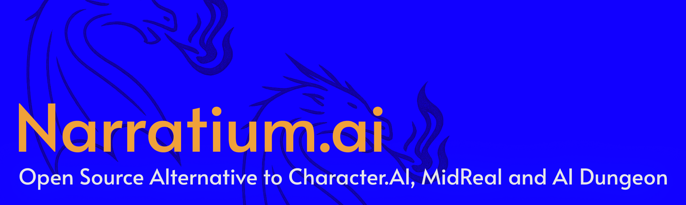

# Narratium

AI 角色扮演面板与本地优先的故事工作台。



本仓库是 Narratium 面板代码库的当前维护版本，由旧仓库某个 fork/备份版本的本地备份恢复而来。原始上游仓库、历史贡献者图谱、社区链接以及部分旧项目资源目前已经无法由当前维护者访问或追溯，因此后续维护、发布和问题追踪都会在本仓库进行。

当前仓库：<https://github.com/yuzukumo/narratium-webui>

[](https://github.com/yuzukumo/narratium-webui)
[](https://github.com/yuzukumo/narratium-webui/forks)
[](https://github.com/yuzukumo/narratium-webui/commits/main)
[](./LICENSE)

[English README](./README.md) | [入门指南](./docs/GETTING_STARTED.md) | [Issues](https://github.com/yuzukumo/narratium-webui/issues) | [Releases](https://github.com/yuzukumo/narratium-webui/releases)

## 项目说明

Narratium 是一个可自托管的 AI 角色聊天面板，用于管理分支对话、提示词预设、世界书和正则文本处理。它更偏向本地运行或小规模私有部署，用户数据主要在浏览器/本地环境中处理，而不是依赖托管服务。

本仓库仅包含面板与服务代码，不内置角色卡、故事内容、用户生成内容或社区贡献内容资产。

## 功能特点

- AI 角色聊天工作台，支持长对话流程。
- 兼容 SillyTavern PNG 角色卡导入。
- 可视化对话树，用于追踪和切换分支。
- 提示词预设、世界书、正则脚本和高级设置编辑器。
- OpenAI、Anthropic、Gemini 以及兼容接口配置。
- 用户数据的本地导入/导出工具。
- Docker Compose 部署与 Pake 打包脚本。

## 快速开始

### Docker Compose

```bash
docker compose up -d
```

然后打开 <http://localhost:5000>。

compose 文件使用当前镜像名：

```yaml
ghcr.io/yuzukumo/narratium-webui:latest
```

### 从源码运行

推荐环境：

- Node.js 20+
- pnpm
- Git

```bash
git clone https://github.com/yuzukumo/narratium-webui.git
cd narratium-webui
pnpm install
pnpm dev
```

然后打开 <http://localhost:5000>。

常用脚本：

```bash
pnpm build
pnpm lint
pnpm test
```

## 许可证

本仓库使用 MIT 许可证。详见 [LICENSE](./LICENSE)。

用户自行导入或生成的内容不属于本仓库范围，应遵循其来源、创作者或平台的对应条款。
